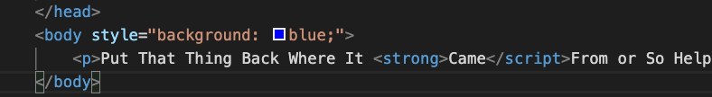
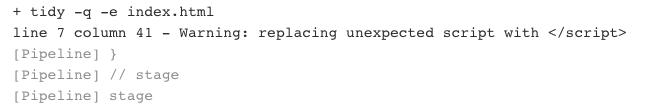
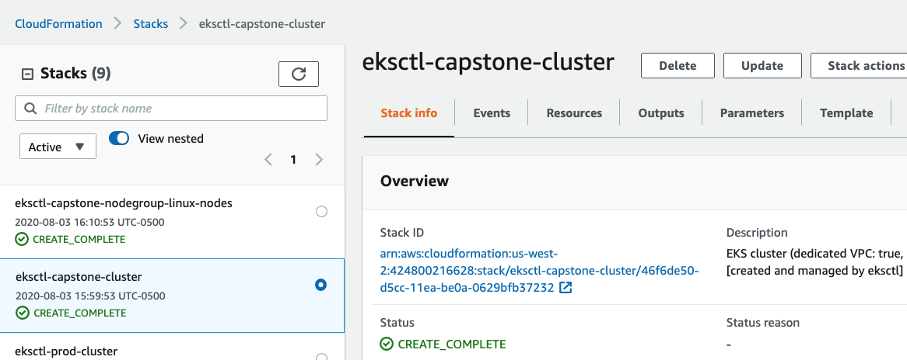
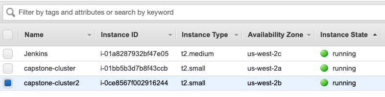
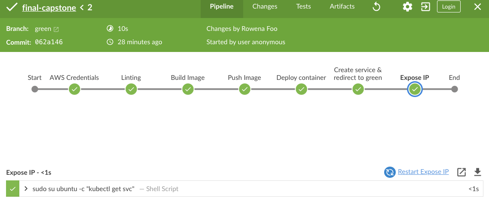
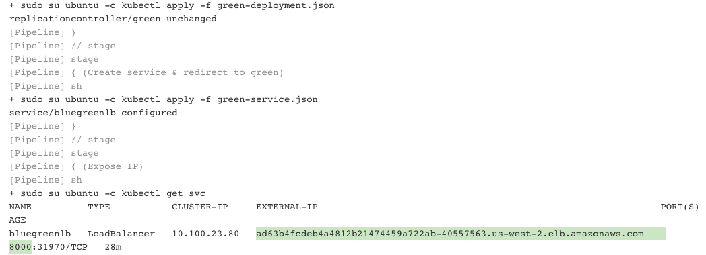

# Cloud DevOps Capstone Project

## Overview
This project aims to develop a CI/CD pipeline for microservices applications with blue/green deployment. The CI step includes a simple linter, and the CD steps include:
- Pushing the built Docker container(s) to the Docker repository
- Deploying these Docker container(s) to a small Kubernetes cluster using AWS Kubernetes cluster
- Building these steps in Jenkins pipeline


## Steps
<details>
<summary>Click to expand</summary>

- EC2 Instance with Ubuntu 18.04
- Install Jenkins & plugins
```
Jenkins plugins: 

Amazon Web Services SDK 
Ansible plugin
Ant plugin
Blue Ocean
CloudBees AWS Credentials Plugin
Docker Pipeline
GitHub Pipeline for Blue Ocean
Pipeline: AWS Steps
```

- Add IAM policy for blue/green deployment

- Add AWS credentials in Jenkins

- Add Docker credentials in Jenkins

- [Install docker](https://www.digitalocean.com/community/tutorials/how-to-install-and-use-docker-on-ubuntu-18-04)

- [Install dependencies to deploy cluster with AWS EKS](https://docs.aws.amazon.com/eks/latest/userguide/getting-started-eksctl.html)

- Create AWS keypair for cluster and create cluster using `eksctl`

- Create blue & green branches, each with the following files:
    - Dockerfile
    - Jenkinsfile
    - our "app": `index.html`

- Build Jenkins pipeline

</details>

## Screenshots requirements

<details>
    <summary>Click to expand</summary>
    
### Legit Linter

Breaking the code in `index.html`


BlueOcean view in Jenkins


Jenkins Console Output


### CloudFormation Cluster




### Blue Deployment


### Green Deployment





</details>

## Problems I ran into / Lessons Learned 

<details>

<summary>Click here to expand</summary>

- Unable to push to docker using Jenkins, even after adding docker credentials to Jenkins. Finally found a way to have Jenkins use docker credentials with `withDockerRegistry([ credentialsId: "dockerhub", url: "" ])`.

- Installing `kubectl` on Ubuntu user instead of Jenkins user caused issues where Jenkins is unable to run `kubectl` commands.  My workaround is using `sudo su ubuntu -c` to run it.

- Switching between blue and green app doesn't show at first, but later realized it must be cached. By switching to incognito, I was able to see the switch.

</details>

